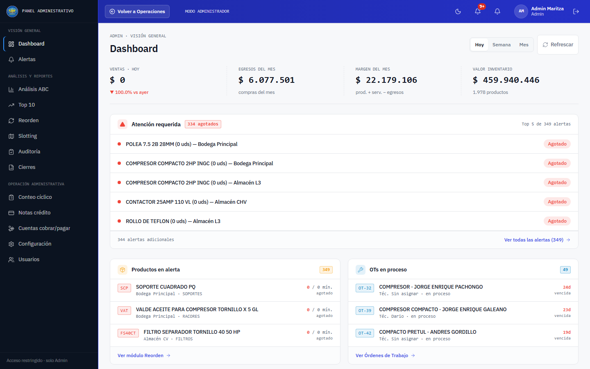
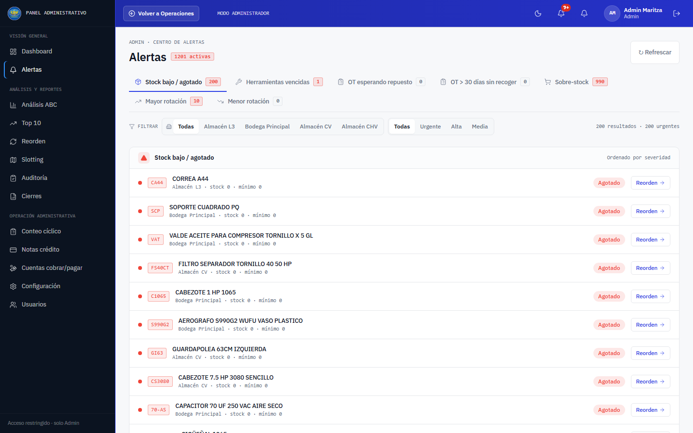
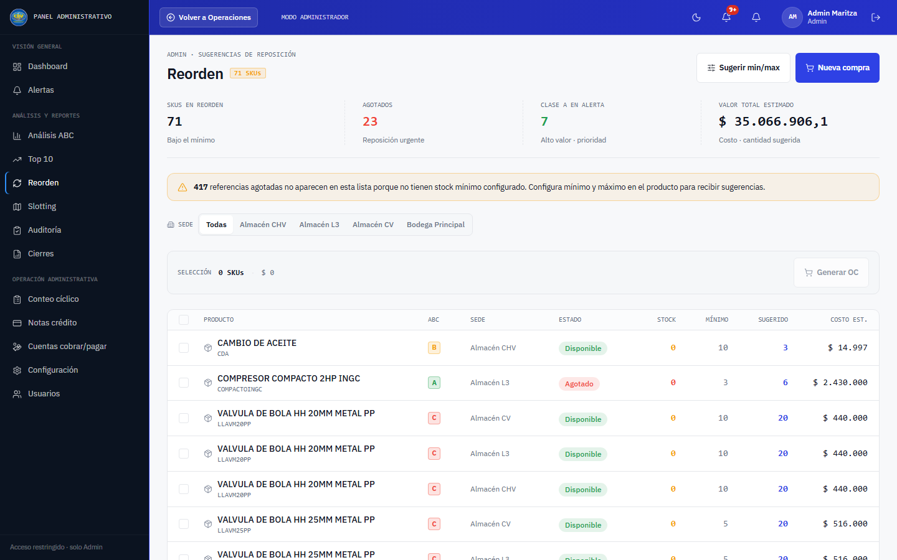
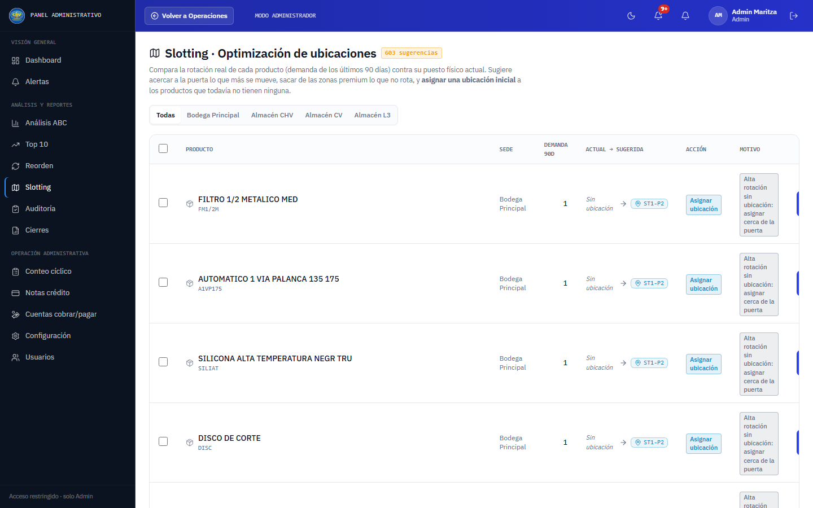
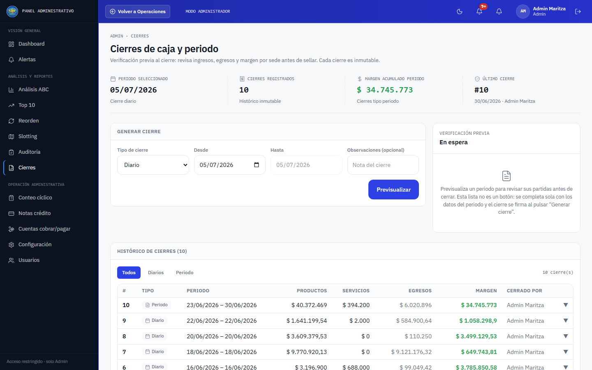
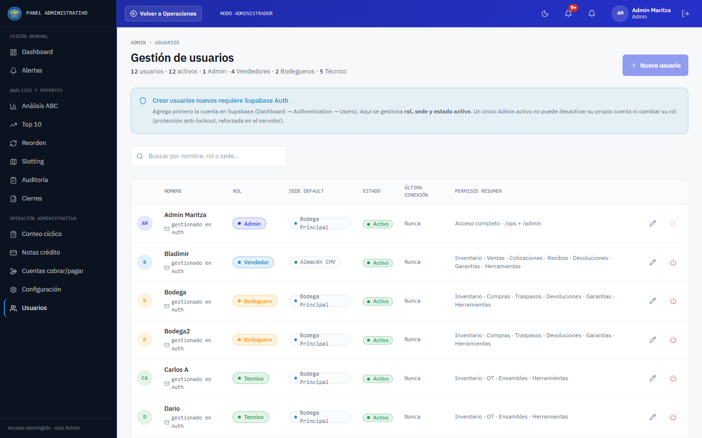

# Manual del Panel de Administrador · Compresores del Valle

_Guía completa, explicada paso a paso, de cada pantalla del Panel de Administrador. Está pensada para leerse con calma la primera vez y usarse después como referencia rápida cuando tengas una duda puntual._

**Cómo usar este manual:** no necesitas leerlo de corrido. Cada sección es independiente: si tienes una duda sobre "Reorden", ve directo a esa sección. Cada una sigue el mismo hilo: qué es la pantalla, qué ves al entrar, cómo se usa paso a paso, cuándo conviene usarla y qué cosas importantes debes tener presentes.

**Quién puede ver el Panel de Administrador:** solo el usuario con rol **Admin** (Carlos) tiene acceso a todas estas pantallas. Los demás roles (Bodeguero, Vendedor, Técnico) trabajan en la parte operativa de la app (ventas, inventario, órdenes, etc.) y no ven este panel, salvo dos excepciones puntuales que se explican en la sección de **Conteo cíclico**, donde el Bodeguero sí participa dentro de su propia sede.

---

## Índice

1. [Visión general](#1-visión-general)
   - [Dashboard](#dashboard)
   - [Alertas](#alertas)
2. [Análisis y reportes](#2-análisis-y-reportes)
   - Análisis ABC
   - Top 10
   - Reorden (y el asistente de mínimos/máximos)
   - Slotting
   - Auditoría
   - Cierres
3. [Operación administrativa](#3-operación-administrativa)
   - Conteo cíclico
   - Notas crédito
   - Cuentas por cobrar y pagar
   - Configuración
   - Usuarios

---

# 1. Visión general

## Dashboard

### Qué es y para qué sirve

El Dashboard es la primera pantalla que ves al entrar al Panel de Administrador. Funciona como el tablero de mando de un carro: de un vistazo te dice cómo va el negocio hoy, sin que tengas que ir módulo por módulo a buscar la información. Está pensado para revisarlo todos los días, incluso varias veces al día, porque se actualiza solo.

### Qué encuentra al entrar

Arriba del todo hay una fila con cuatro números grandes. El primero es **Ventas** del periodo que elijas (Hoy, Semana o Mes, con los botones de al lado). Debajo aparece una flechita verde o roja que compara las ventas de hoy contra las de ayer, por ejemplo "▲ 12.3% vs ayer", y si ayer no hubo ventas, en vez de la flecha verás "sin referencia" porque no se puede calcular un porcentaje contra cero. Vale la pena tener presente algo importante: este número de "Ventas" cuenta solo lo que se vendió directamente en el mostrador. No incluye el dinero que entra por Órdenes de Trabajo, que aparece por separado más abajo en el margen. Es intencional, para no contar el mismo ingreso dos veces.

El segundo número es **Egresos del mes**, el total de las compras hechas a proveedores este mes, sin contar las canceladas. El tercero es el **Margen del mes**: ventas directas más ingresos por servicios de OT, menos los egresos. Si sale en rojo, significa que este mes se ha gastado más de lo que ha entrado, y vale la pena revisar por qué. El cuarto es el **Valor del inventario**, cuánto valen hoy todos los productos en existencia según su costo promedio, con el total de productos activos del catálogo debajo.

Justo después viene el bloque de "Atención requerida", con un triángulo rojo: la lista de los cinco productos más urgentes en stock bajo o agotados, ordenados por gravedad (primero los agotados). Cada línea muestra el producto y la sede donde está bajo. Si no hay ninguno, verás un mensaje tranquilizador: "Sin alertas de stock activas". Un enlace lleva al módulo completo de Alertas si quieres ver toda la lista, no solo el top cinco.

Debajo hay cuatro bloques en cuadrícula. "Productos en alerta" muestra hasta tres productos en stock bajo o agotado con su sede, categoría y cuánto tiene contra cuánto debería tener de mínimo, con un enlace a Reorden. "OTs en proceso" muestra hasta tres Órdenes de Trabajo abiertas ahora mismo, con el técnico asignado y cuántos días lleva abierta (si lleva mucho tiempo, se resalta). Aquí hay un detalle que conviene tener claro: el contador grande (por ejemplo "9") cuenta todas las OT que no están entregadas ni canceladas, incluyendo las recién recibidas y las ya terminadas esperando que el cliente las recoja, mientras que las tres filas de detalle solo muestran las que están literalmente "en proceso" o "esperando repuesto". Por eso el contador puede ser más alto que lo que ves listado ahí abajo; para el detalle completo de las terminadas sin recoger conviene ir a la pestaña correspondiente en Alertas. "Cotizaciones por vencer" muestra hasta tres cotizaciones próximas a vencerse, cada una con su enlace a Cotizaciones. Y "Actividad reciente" trae un mini historial de los últimos movimientos de inventario de toda la empresa (ventas, compras, traspasos, ajustes de conteo, ensambles), con quién lo hizo y a qué hora, como un adelanto de lo que se ve con más detalle en Auditoría.

Más abajo hay dos gráficas: una de línea con la tendencia de ventas de los últimos 7 días, útil para ver si las ventas suben, bajan o si hubo algún día raro (por ejemplo un domingo en cero), y una de barras horizontales comparando cuánto ha vendido cada sede (BODEGA, CV, CHV, L3) en lo que va del mes. Cierra la pantalla el Top 5 de productos del mes, con las unidades vendidas y el total en pesos de cada uno.

### Cómo se usa paso a paso

Al entrar al Panel de Administrador, el Dashboard es la pantalla que se abre por defecto. Lo primero es mirar la fila de cuatro números para tener el panorama general del día o del mes. Si el "Margen del mes" aparece en rojo, o hay alertas en el bloque rojo, conviene hacer clic en el módulo correspondiente para investigar (Reorden si es stock, Cierres si es dinero). Los botones "Hoy / Semana / Mes" arriba a la derecha cambian el periodo del KPI de Ventas, y el botón "Refrescar" fuerza una actualización inmediata, aunque la pantalla ya se actualiza sola cada minuto mientras la tengas abierta. Cualquier producto, orden o cotización de los bloques de atención se puede clicar para ir directo a resolverlo.

### Cuándo usarla

Lo ideal es revisarlo cada mañana, como primer vistazo antes de empezar el día, para saber si algo necesita atención urgente. También conviene mirarlo antes de una reunión o de tomar una decisión de compra, para tener los números frescos, o simplemente cuando quieras saber cómo va el mes sin tener que ir a revisar Cierres o Reorden por separado.

### Cosas importantes a tener en cuenta

El Dashboard se actualiza solo cada 60 segundos mientras la pestaña esté abierta y visible; si cambias de pestaña del navegador, deja de refrescar automáticamente hasta que vuelvas. La flecha de comparación siempre compara hoy contra ayer, sin importar qué periodo tengas seleccionado en el filtro de arriba. Y conviene recordar que "Ventas" no incluye las ventas de repuestos dentro de una Orden de Trabajo, porque esas entran como "ingresos por servicios" en el cálculo del margen, para no duplicar el ingreso. Si un mes hiciste muchas reparaciones y pocas ventas de mostrador, es normal que el número de "Ventas" se vea bajo aunque el negocio haya ido bien: el que sí suma ambos es el "Margen del mes". Por último, si una gráfica muestra "Sin datos para mostrar", simplemente significa que no hubo ventas en ese periodo, no es un error.

---

## Alertas

### Qué es y para qué sirve

Es el centro de avisos de todo el negocio: una sola pantalla donde ves, organizados por pestañas, todos los temas que requieren tu atención (stock bajo, herramientas que no han devuelto, órdenes esperando repuestos, órdenes terminadas que el cliente no ha recogido, productos que sobran o que casi no se venden). Piénsalo como tu lista de pendientes generada automáticamente por el sistema.

### Qué encuentra al entrar

Arriba hay un contador grande de cuántas alertas están activas en total, y debajo siete pestañas, cada una con su propio contador en rojo si hay algo pendiente o en gris si está en cero. "Stock bajo / agotado" muestra productos cuyo stock llegó al mínimo o se acabó, con un botón directo a Reorden. "Herramientas vencidas" son préstamos a trabajadores que ya deberían haberse devuelto, con un botón al módulo de Herramientas. "OT esperando repuesto" son Órdenes de Trabajo detenidas por falta de un repuesto. "OT > 30 días sin recoger" son órdenes ya terminadas que el cliente todavía no ha recogido, con su teléfono a la vista para poder llamarlo. "Sobre-stock" son productos con existencias que no se han vendido nada en los últimos 30 días, dinero quieto en la bodega. "Mayor rotación" es el top 10 de lo que más se ha vendido en 30 días (información útil, no exactamente un problema). Y "Menor rotación" son productos con ventas muy escasas comparadas con el resto, para revisar precio o promoción.

Arriba de la lista hay un filtro de sede, que solo aparece si hay más de una sede con datos en el conjunto de alertas cargado, y un filtro de prioridad con cuatro opciones: Todas, Urgente, Alta y Media. A la derecha aparece un contador con el formato "N resultados · M urgentes", y cada fila trae un punto de color y una etiqueta de prioridad para saber de un vistazo qué atender primero.

### Cómo se usa paso a paso

Se entra a Alertas desde el menú lateral o desde el enlace del Dashboard. La pestaña por defecto es "Stock bajo/agotado"; de ahí se cambia a la que interese revisar, y arriba se puede acotar la lista con los filtros de sede y prioridad. El botón de acción de cada fila (por ejemplo "Reorden", "Ver" o "Abrir OT") lleva directamente a resolver ese pendiente en el módulo correspondiente: Alertas en sí mismo no resuelve nada, solo avisa y guía. El botón "Refrescar" fuerza que vuelva a consultar todo.

### Cuándo usarla

Es una buena rutina de barrido al iniciar el día, antes o después de revisar el Dashboard. También sirve para confirmar rápido si un producto está en alerta de stock bajo en alguna sede cuando alguien pregunta si hay disponible. Una vez por semana conviene revisar "OT > 30 días sin recoger" para llamar a esos clientes, porque es dinero (y espacio en el taller) esperando. "Sobre-stock" y "Menor rotación" ayudan a decidir promociones o dejar de reordenar ciertos productos, y "Herramientas vencidas" conviene revisarla antes de prestar una herramienta nueva.

### Cosas importantes a tener en cuenta

Alertas no tiene botón para marcar como resuelto ni para ignorar una alerta: desaparece sola de la lista en cuanto la causa raíz se soluciona, por ejemplo en cuanto entra stock nuevo o el cliente recoge la OT. Los umbrales de qué cuenta como "stock bajo" se ajustan desde Configuración → Parámetros o directamente en la ficha del producto, no desde esta pantalla. La pestaña "OT > 30 días sin recoger" en realidad usa un número configurable (el parámetro "días para alerta de OT abandonada", 30 por defecto): si alguien lo cambia, la pestaña sigue mostrando el texto fijo "OT > 30 días" aunque esté avisando con el nuevo número. En las pestañas de rotación y sobre-stock verás etiquetas propias como "Alta", "Baja" o "Revisar" en vez de "Urgente/Alta/Media"; describen la fila y no necesariamente coinciden con el nombre exacto del filtro de prioridad que las agrupa por dentro. "Sobre-stock" y las de rotación siempre miran los últimos 30 días fijos, sin poder cambiar el rango desde aquí. Y si una pestaña muestra un ícono de vacío, es una buena noticia, no un error de carga.

---

# 2. Análisis y reportes

## Análisis ABC

### Qué es y para qué sirve

Es una foto de qué tan importante es cada producto para las ventas de la empresa. Imagina que ordenas todos tus productos de mayor a menor según cuánta plata han generado, y luego los agrupas en tres grupos: los que representan la mayoría del dinero (A), los que aportan una porción media (B) y una cola larga de productos que casi no mueven plata pero son muchos (C). Esta pantalla muestra ese ordenamiento para saber dónde poner más atención (contratos con proveedores, control de stock más estricto) y dónde se puede relajar el control o incluso liquidar inventario que no se vende.

La clasificación A/B/C se recalcula sola una vez al mes, a las 00:00 hora Colombia del día 1, usando las ventas de los últimos 90 días (tanto ventas directas como repuestos usados en Órdenes de Trabajo). También hay un botón para forzar el recálculo en cualquier momento.

### Qué encuentra al entrar

Arriba a la derecha hay un selector de periodo (Último mes, Último trimestre, Último año) que solo cambia qué ventana de ventas se usa para mostrar los montos en la tabla; no toca la clasificación A/B/C en sí, que siempre usa 90 días. Junto a él está el botón "Recalcular ABC", que pide confirmación antes de correr de nuevo la clasificación de todos los productos (puede tardar varios segundos porque revisa miles de referencias).

Cuatro tarjetas resumen los ingresos del periodo elegido y cuántos productos están clasificados en total, más el porcentaje, la cantidad y el valor en pesos de cada clase: A de alto valor, B intermedia y C de cola larga. Debajo hay pestañas para filtrar por Todas, Clase A, Clase B o Clase C, cada una con su contador. La tabla muestra la letra de clase en un cuadrito de color (verde para A, naranja para B, rojo para C), la referencia y el nombre del producto con su categoría, las ventas en pesos y en unidades del periodo elegido, y el porcentaje acumulado, que ayuda a entender visualmente por qué un producto quedó en A, B o C (es la misma matemática de la regla 80/20). La columna "Sugerencia" trae un texto fijo según la clase: para A dice "Alto valor · control estricto · revisar contrato proveedor", para B "Valor medio · control moderado · mantener" y para C "Cola larga · control simple · candidato a liquidar". No es una recomendación calculada producto por producto, sino una política general por clase. En celular la misma información aparece en tarjetas apiladas.

### Cómo se usa paso a paso

Al entrar, la pantalla carga automáticamente todos los productos activos con su clasificación actual. Se puede cambiar el periodo de ventas que se ve (mes, trimestre, año) con el selector de arriba, y usar las pestañas para enfocarse en una sola clase. La tabla queda ordenada de mayor a menor venta, con el porcentaje acumulado a la vista. Si conviene forzar que el sistema recalcule ya, por ejemplo después de una temporada fuerte, se pulsa "Recalcular ABC", se confirma en el cuadro de diálogo y se espera unos segundos.

### Cuándo usarla

Conviene revisarla al inicio de mes, para ver cómo quedó la clasificación tras el recálculo automático, y antes de negociar con un proveedor de un producto clase A, para saber que vale la pena cuidar ese contrato. También sirve para identificar candidatos a liquidar o descontinuar entre la clase C, y antes de decidir en qué productos invertir más plata de inventario.

### Cosas importantes a tener en cuenta

La clasificación siempre se basa en 90 días de ventas, sin importar qué periodo se elija en pantalla: el selector solo cambia los montos que se ven, no la letra de clase asignada. El recálculo manual tiene un límite de 30 segundos; si se demora más aparece un mensaje pidiendo contactar soporte, lo cual no significa que algo se dañó, solo que hay que reintentar con más calma. No hay botones de edición en esta pantalla, es solo de consulta (para cambiar el mínimo o máximo de un producto según su clase hay que ir a Reorden), y cualquier usuario Admin puede recalcular, sin diferencias de permisos dentro de la pantalla más allá de que solo el Admin tiene acceso a ella.

---

## Top 10

### Qué es y para qué sirve

Es un cuadro de honor que muestra quiénes o qué son los "mejores" en cuatro categorías (Productos, Clientes, Categorías y Proveedores) durante el periodo que se elija. Es útil para responder rápido preguntas como cuál es el producto estrella, quién es el mejor cliente o a qué proveedor se le está comprando más.

### Qué encuentra al entrar

Arriba hay un selector de periodo (Último mes, Último trimestre, Último año) y cuatro pestañas con ícono para Productos, Clientes, Categorías y Proveedores, cada una cambiando todo el contenido de la pantalla. Cuatro tarjetas resumen, según la pestaña activa, el total vendido o comprado del Top 10 en el periodo, las unidades totales, el ticket promedio y el número de transacciones (o de órdenes de compra, en Proveedores).

La lista muestra la posición numerada del 1 al 10, con medalla para los primeros tres lugares, el nombre del elemento (con la referencia como subtítulo en la pestaña Productos), y en pantallas grandes el monto, las unidades si aplica y la variación porcentual contra el periodo anterior equivalente. Cuando no hay datos del periodo anterior para comparar, se muestra un guion en vez de inventar un número. Cada fila trae además una barra de progreso que representa visualmente qué tan grande es ese valor comparado con el primer lugar del ranking.

### Cómo se usa paso a paso

Por defecto se ve el ranking de Productos del último mes. Se cambia de pestaña para ver Clientes, Categorías o Proveedores, y el periodo si se quiere ver el trimestre o el año. La variación (flecha o porcentaje) dice si ese producto o cliente está creciendo o cayendo respecto al periodo anterior. Es una pantalla de solo consulta, sin botones de acción: sirve para informar decisiones, no para ejecutarlas desde aquí.

### Cuándo usarla

Es útil en reuniones mensuales de revisión de ventas, para presentar los productos y clientes más importantes, y para decidir si vale la pena dar un trato especial (descuento, prioridad de stock) a un cliente frecuente. También ayuda a evaluar proveedores para negociar mejores condiciones, y a detectar categorías de producto que crecen o caen mes a mes.

### Cosas importantes a tener en cuenta

La pestaña Proveedores mide compras, no ventas, por lo que sus textos cambian (Compras en vez de Ventas, Órdenes de compra en vez de Transacciones); es fácil confundirse si no se lee el encabezado. La variación puede aparecer como guion cuando no hay suficiente historial en el periodo anterior, lo cual no es un error, es que el sistema prefiere no inventar un número sin base real. No hay forma de editar ni exportar nada desde aquí. Los clientes sin nombre se agrupan bajo "Consumidor final" y los proveedores sin nombre bajo "Sin proveedor"; si hay mucho volumen ahí, vale la pena revisar que se esté registrando bien el nombre al hacer la venta o la compra.

A diferencia del KPI "Ventas" del Dashboard, que excluye las ventas de Órdenes de Trabajo, las cuatro pestañas de Top 10 sí incluyen las ventas hechas dentro de una OT; no hay inconsistencia entre ellas, solo con el Dashboard. Y en periodos largos como "Último año", con mucho volumen de ventas, el cálculo trae un límite interno de filas para no sobrecargar la consulta. En un negocio con miles de transacciones al año esto en teoría podría dejar alguna fuera del ranking, aunque es poco probable que afecte el Top 10 real en la práctica.

---

## Reorden (y el asistente de mínimos/máximos)

### Qué es y para qué sirve

Esta es la pantalla que avisa "esto se está por acabar, hay que comprar más". Compara el stock actual de cada producto contra el mínimo configurado, y si está por debajo aparece aquí con una cantidad sugerida de cuánto pedir. Además incluye un asistente que calcula automáticamente cuál debería ser el mínimo y el máximo de stock de cada producto, según cuánto se ha vendido o consumido realmente en los últimos 90 días, para no tener que adivinar esos números a ojo.

### Qué encuentra al entrar

El título "Reorden" trae un contador de cuántos SKUs están hoy por debajo de su mínimo. A la derecha hay dos botones: "Sugerir min/max", visible solo para el Admin, que abre el asistente descrito más abajo, y "Nueva compra", que lleva directo al flujo normal de crear una orden.

Cuatro tarjetas resumen los "SKUs en reorden" (productos bajo su mínimo), los "Agotados" (en rojo si hay alguno, reposición urgente), la "Clase A en alerta" (cuántos de los productos en reorden son de alto valor) y el "Valor total estimado" de comprar todo lo sugerido en la lista. Si aplica, aparece un aviso amarillo indicando cuántas referencias agotadas no aparecen en la lista porque todavía no tienen mínimo configurado, un recordatorio de que hay que configurarles mínimo y máximo para que el sistema empiece a vigilarlas. También hay un filtro de sede si hay más de una con sugerencias.

Al marcar productos se activa una barra de selección con el conteo y el valor total, junto al botón "Generar OC" que lleva a Nueva compra con esos productos ya preseleccionados. La tabla trae casilla de selección, producto, la letra ABC con su color, la sede, el estado ("Agotado" en rojo o "Stock bajo" en naranja), el stock actual, el mínimo configurado, la cantidad sugerida y el costo estimado, con un total al final. En celular se ve la misma información en tarjetas con casilla grande.

### Cómo se usa paso a paso (pantalla principal)

Al entrar se ve el listado de productos bajo su mínimo, con los datos más críticos primero (Agotado en rojo destaca). Si conviene enfocarse en una sola sede, se usa el filtro correspondiente. Se marcan las casillas de los productos a comprar ahora, o se usa la casilla del encabezado para marcar todos los visibles, y se revisa el valor total de la selección en la barra de arriba. Al pulsar "Generar OC" se llega a la pantalla de Nueva compra con esos productos ya cargados, listos para ajustar cantidades y proveedor antes de confirmar.

### Cómo se usa paso a paso (asistente "Sugerir min/max")

Este es un modal que solo puede abrir el Admin, pulsando el botón "Sugerir min/max". Al abrirse, el sistema calcula automáticamente el mínimo y máximo ideal para los productos que sí tuvieron demanda en los últimos 90 días (ventas, consumo en Órdenes de Trabajo y consumo en Ensambles). Un producto sin ningún movimiento en ese periodo no aparece en el asistente; si no hay ninguno con demanda, se ve el aviso "Sin demanda registrada en el periodo".

Arriba del modal hay tres parámetros ajustables con sus valores por defecto: "Lead time (días)", cuántos días tarda en llegar un pedido (7 por defecto; si los proveedores se demoran más, conviene subirlo para tener más colchón de stock mínimo); "Factor de seguridad" (1.5 por defecto), un multiplicador extra para cubrir imprevistos en la demanda; y "Máx = mín ×" (3 por defecto), el factor por el que se multiplica el mínimo para obtener el máximo. Al cambiar estos números y pulsar "Recalcular", el sistema vuelve a calcular todas las sugerencias, y guarda esos parámetros para toda la empresa, no solo para quien los cambió, así que aplican para todos los usuarios de aquí en adelante hasta que alguien los ajuste de nuevo.

Debajo hay un interruptor "Solo sin configurar", activado por defecto, que muestra solo los productos que todavía no tienen mínimo/máximo configurado manualmente; al desmarcarlo también se ven los que ya tienen configuración, marcados con la etiqueta "Configurado". La tabla trae la clase ABC, la demanda de 90 días, el mínimo y máximo actual si tiene, el sugerido, y si ya está configurado.

Por defecto el sistema preselecciona automáticamente solo los productos que NO tienen configuración todavía, para proteger los valores que alguien ya ajustó manualmente y no sobrescribirlos sin querer. Se puede marcar o desmarcar producto por producto, o usar la casilla del encabezado para todos los visibles en ese momento. Al pulsar "Aplicar seleccionados" aparece un cuadro de confirmación con cuántos productos se van a actualizar; al confirmar, el sistema actualiza el mínimo y máximo de cada uno y avisa cuántos se actualizaron. Ese mensaje se queda en el modal (la pantalla de Reorden ya se refrescó detrás, pero el modal no se cierra solo), y se cierra con la "X" arriba a la derecha cuando se quiera, antes o después de aplicar, sin perder nada.

### Cuándo usarla

Vale la pena revisar la pantalla principal todos los días o cada pocos días, para saber qué comprar antes de quedarse sin stock, y al armar la orden de compra semanal o quincenal. El asistente de min/max conviene usarlo quincenal o mensualmente para revisar productos nuevos o sin configuración, y periódicamente (cada dos o tres meses) para refrescar los ya configurados si la demanda cambió mucho por temporada.

### Cosas importantes a tener en cuenta

Solo el Admin ve el botón "Sugerir min/max"; cualquier usuario con acceso a esta pantalla puede seleccionar productos y generar una orden de compra. Aplicar las sugerencias de min/max sin revisar corre el riesgo de sobrescribir un mínimo que alguien configuró a propósito por una razón especial, como un producto de temporada; por eso el sistema protege por defecto los productos ya configurados y no los preselecciona, así que conviene revisarlos manualmente antes de incluirlos si de verdad se quiere cambiarlos.

Los productos agotados que no tienen mínimo configurado en absoluto no aparecen en la lista principal de Reorden (el aviso amarillo dice cuántos son). Es fácil pensar que todo está bien cuando en realidad hay faltantes invisibles por falta de configuración; el asistente de min/max sirve justamente para configurarlos y que empiecen a aparecer. El color del stock en la tabla (rojo para agotado, naranja para bajo) da la urgencia de un vistazo sin necesidad de leer el número, y "Generar OC" no crea la compra automáticamente: lleva al formulario de Nueva compra con los productos precargados, pero hay que revisar cantidades, proveedor y confirmar. Por último, si el número de SKUs bajo el mínimo llega a ser tan grande que no caben todos en la lista, aparece un aviso amarillo indicando cuántos se están mostrando de cuántos hay en total, para que los KPIs de arriba nunca se vean completos sin avisar.

---

## Slotting

### Qué es y para qué sirve

Slotting es literalmente "acomodar el estante". Esta pantalla compara qué tanto rota cada producto (cuánto se vende o se consume en los últimos 90 días) contra dónde está físicamente ubicado en la bodega, y sugiere tres cosas: asignarle una ubicación inicial al producto que todavía no tiene ninguna, subir cerca de la puerta lo que más se mueve, y bajar al fondo lo que casi no rota. No hace falta asignar ubicación manualmente a cada producto antes de usar esta pantalla: Slotting ya dice dónde ponerlo la primera vez.

### Qué encuentra al entrar

El título "Slotting · Optimización de ubicaciones" trae un contador de cuántas sugerencias hay, y una explicación corta de qué hace la pantalla, además de un filtro de sede si hay sugerencias en más de una. En el encabezado de la tabla hay una casilla para seleccionar todas las sugerencias visibles de una vez, y una casilla por fila para elegir sugerencias individuales. Al marcar al menos una aparece una barra de selección arriba con el conteo y el botón "Aplicar seleccionadas", pensado para aplicar de un tirón docenas o cientos de sugerencias sin entrar fila por fila: con cerca de 3.000 productos en el catálogo, revisar uno por uno no es práctico.

La tabla muestra el producto con su referencia, la sede, la demanda de los últimos 90 días (el número que justifica la sugerencia), y una columna "Actual → Sugerida": si el producto ya tiene ubicación aparece un chip con el código actual, y si no, el texto "Sin ubicación"; luego una flecha y el chip de la ubicación sugerida, con un mapa visual de la bodega al tocarlo. La columna "Acción" trae una etiqueta en azul para "Asignar ubicación" (el producto no tenía ubicación y se le da una por primera vez), en naranja para "Subir" (acercarlo a la puerta porque rota mucho) o en gris para "Bajar" (alejarlo porque casi no rota), seguida del motivo concreto de esa sugerencia y un botón "Aplicar" al final de cada fila, visible solo para Admin o Bodeguero. En celular se ve la misma información en tarjetas.

### Cómo se usa paso a paso

Al entrar, el sistema calcula automáticamente las sugerencias: para productos sin ubicación con ventas o consumo reciente sugiere dónde ponerlos por primera vez, y para los que ya tienen ubicación sugiere si conviene moverlos. Para aplicar de a una se revisa la fila y se pulsa "Aplicar", que pide confirmar antes de mover o asignar. Para aplicar muchas de una vez, lo normal al empezar con cientos de productos sin ubicación, se marcan las casillas correspondientes (o la del encabezado para todas las visibles) y se pulsa "Aplicar seleccionadas": un solo cuadro de confirmación indica a cuántos productos se les va a asignar o mover la ubicación. Al confirmar, individual o en lote, el sistema actualiza la ubicación de cada producto y esas filas desaparecen de la lista. Las sugerencias que no tengan sentido para la operación real, por ejemplo si el espacio sugerido no es físicamente práctico por el tamaño del producto, se pueden ignorar sin problema: no hay obligación de aplicar todo.

### Cuándo usarla

Al empezar a usar esta función por primera vez conviene revisar por sede, empezando por la que más movimiento tenga, y aplicar en lote las sugerencias de "Asignar ubicación", para arrancar con la bodega organizada sin ir producto por producto desde la ficha de cada uno. Periódicamente, por ejemplo cada trimestre, conviene reajustar la bodega si cambiaron los productos que más rotan (temporada, nuevos productos estrella); ahí sí aparecerán sugerencias de "Subir" y "Bajar" entre productos ya ubicados. También sirve cuando se está reorganizando físicamente la bodega y se quiere un criterio objetivo, basado en ventas reales, de qué debería estar más a mano.

### Cosas importantes a tener en cuenta

Solo se sugiere ubicación inicial para productos que sí tuvieron alguna venta o consumo en los últimos 90 días; uno con cero movimiento en ese periodo no aparece aquí, y se le puede asignar ubicación manualmente desde su ficha sin apuro, porque no importa mucho dónde quede algo que no se mueve. Solo Admin y Bodeguero pueden seleccionar y aplicar sugerencias; otros roles pueden ver la pantalla pero no ejecutan cambios, ni ven casillas ni botones de aplicar.

Al aplicar, individual o en lote, el cambio de ubicación se hace de inmediato tras confirmar, sin un paso intermedio de revisión, así que conviene confirmar solo si de verdad se va a mover o ubicar el producto físicamente ese día, para que el sistema y la realidad coincidan. En una aplicación en lote, si un producto del grupo falla por algún motivo, ninguno de los del lote se aplica; hay que revisar el mensaje de error e intentar de nuevo. Varios productos pueden compartir el mismo código de ubicación sugerida, por ejemplo muchos de alta rotación terminando todos en "ST1-P2": eso es normal, una posición de estante en esta bodega guarda varias referencias pequeñas, no es un producto por casillero.

Cada acción tiene su color: "Subir" en naranja porque hay que mover algo ahora, "Asignar ubicación" en azul porque es informativo, y "Bajar" en gris por su menor urgencia. Si en algún momento la lista aparece vacía, significa que los productos ya están bien ubicados según su rotación actual, no es un error de carga. Solo se consideran productos activos en el catálogo: uno descontinuado no genera sugerencia aunque haya tenido demanda en el pasado. Para que aparezca la sugerencia "Asignar ubicación", el producto necesita ya tener una fila de inventario en esa sede, aunque sea sin ubicación asignada; si nunca se ha registrado en el inventario de una sede, Slotting no lo va a sugerir ahí hasta que exista ese registro. Y el contador de sugerencias del encabezado siempre cuenta el total de todas las sedes, aunque el filtro de sede esté mostrando solo una: no hay que preocuparse si ese número no coincide con las filas visibles en la tabla filtrada.

---

## Auditoría

### Qué es y para qué sirve

La pantalla de Auditoría, también llamada "Bitácora de movimientos", es la caja negra del inventario: un registro que anota automáticamente cada vez que el stock de un producto cambió, sea porque se vendió, se compró, se trasladó entre sedes, se ajustó a mano, se armó o desarmó un ensamble, se devolvió algo o se consumió en una orden de trabajo. Cada línea queda asociada a quién la hizo, en qué sede, a qué hora y con qué cantidad. Es la herramienta para responder preguntas como quién sacó cinco unidades de un repuesto el martes, o por qué el stock de una referencia bajó sin que hubiera una venta.

Ningún registro de esta bitácora se puede editar ni borrar, ni siquiera el Admin puede hacerlo desde la app ni directamente en la base de datos, porque hay un candado técnico que lo impide. Es un historial permanente.

### Qué encuentra al entrar

Cuatro tarjetas resumen lo que está cargado en pantalla en ese momento, no todo el historial completo: "Movimientos cargados" (con un "+" si hay más por traer), "Entradas" (compras, entradas de traspaso, producción de ensambles, devoluciones de cliente), "Salidas" (ventas, salidas de traspaso, consumo de ensambles, consumo por orden de trabajo) y "Ajustes" (correcciones manuales o del conteo cíclico).

Hay un buscador de texto libre por nombre o referencia del producto, un selector de tipo de movimiento, y un botón "Limpiar" que aparece solo si hay algún filtro activo. El panel de "Filtros avanzados", que se despliega con su propio botón, permite acotar por sede, por usuario y por rango de fechas.

La tabla, ordenada del más reciente al más antiguo, muestra fecha y hora, el tipo de movimiento con una etiqueta de color (rojo para salidas, verde para entradas, naranja para ajustes), el producto, la cantidad en rojo o verde según reste o sume stock, el módulo de origen y el usuario con sus iniciales. Al hacer clic sobre cualquier movimiento se abre un panel de detalle con la fecha y hora exacta, el usuario y su rol, el módulo, la sede, el origen (a qué venta, compra u orden específica pertenece) y el stock antes y después del movimiento, por ejemplo "48 → 45". Si el movimiento tiene una observación, también aparece ahí. Al fondo hay una nota fija recordando que el registro es de solo agregado.

### Cómo se usa paso a paso

Al entrar, la pantalla carga automáticamente los movimientos más recientes de todas las sedes, los primeros 50. Para buscar algo puntual, se escribe el nombre o referencia del producto y la lista se filtra sola tras una breve pausa. Si se quiere acotar por tipo de evento, se usa el selector correspondiente, y para preguntas más finas se abre "Filtros avanzados" combinando sede, usuario y rango de fechas, por ejemplo todo lo que movió una persona en BODEGA entre dos fechas. Cualquier fila se puede clicar para ver el detalle completo en el panel derecho, y si la lista es larga, el botón "Cargar más" al final trae los siguientes 50 movimientos, porque no se traen todos de una vez para no sobrecargar la conexión. El botón "Limpiar" regresa la vista al estado inicial.

### Cuándo usarla

Sirve cuando un producto tiene menos o más stock del que debería y hay que averiguar qué pasó y quién lo movió, o para revisar la actividad de un empleado en un día o periodo puntual. También funciona como respaldo antes de un cierre de caja o de un conteo físico, para entender movimientos raros antes de conciliar, y para investigar un ajuste manual o de conteo que llame la atención. En general, cualquier sospecha de faltante o sobrante se investiga aquí primero.

### Cosas importantes a tener en cuenta

Los KPIs de arriba solo cuentan lo que está cargado en pantalla, no la totalidad del historial que cumple el filtro: si se aplicó un filtro y solo se cargaron 50 de 300 movimientos, esos KPIs reflejan los 50, no los 300, y para ver más hay que usar "Cargar más". Es normal que un mismo evento de negocio genere dos movimientos, por ejemplo un traspaso entre sedes genera una salida en la sede de origen y una entrada en la de destino. Un ajuste en naranja no es necesariamente un error, puede ser una corrección legítima o el resultado de un conteo cíclico, aunque si aparecen muchos vale la pena revisarlos uno por uno.

Esta pantalla es de solo consulta: no hay botón para editar, anular ni borrar ningún movimiento, y tampoco existe manera de hacerlo por fuera de la app, la base de datos lo bloquea técnicamente. Si algo quedó mal registrado, la corrección se hace con un movimiento nuevo, nunca modificando el original. La nota de inmutabilidad al final del panel de detalle es literal: ni el equipo de soporte técnico puede alterar un movimiento ya guardado, solo agregar nuevos que lo corrijan hacia adelante. Vale la pena aclarar una limitación honesta de esa misma nota: no se registra firma criptográfica ni la IP de origen de quien hizo el movimiento, la trazabilidad es de usuario, sede y fecha, no forense a ese nivel.

---

## Cierres

### Qué es y para qué sirve

Cierres es la pantalla más delicada de toda la aplicación porque trata directamente con el dinero. Sirve para que, al final de un día o de un periodo más largo como un mes, el dueño revise cuánto entró, cuánto salió y cuánto quedó de margen, y compare el efectivo que el sistema dice que debería haber en caja contra el efectivo real que hay físicamente (esto se llama arqueo o cuadre de caja). Una vez generado, un cierre queda sellado para siempre: no se puede editar ni borrar, así lo intente el Admin. Por eso la pantalla siempre muestra primero una vista previa para revisar todo con calma antes de sellar nada.

Solo el rol Admin puede generar cierres, y solo el Admin puede ver el histórico de los ya generados, por diseño de seguridad de la base de datos: ni siquiera Bodega puede consultar cierres pasados. Bodega, desde su propia pantalla de cierre en Operación, solo puede previsualizar un cierre nuevo (ver los totales calculados y hacer el arqueo de su sede), pero nunca genera el cierre definitivo ni ve el historial anterior.

### Qué encuentra al entrar

Arriba hay una franja con cuatro indicadores: el periodo seleccionado, cuántos cierres existen en total, el margen acumulado de los cierres tipo periodo (en rojo si es negativo, en verde si es positivo) y el número del último cierre con su fecha y quién lo generó.

Luego está la sección para generar un cierre nuevo, con el tipo (Diario o Periodo; si es Diario, el campo "Hasta" se iguala solo a "Desde"), el rango de fechas (una fecha futura sí se puede escribir en el calendario, pero el sistema la rechaza apenas se pulsa "Previsualizar"), un campo de observaciones opcional y el botón "Previsualizar", que calcula los totales de ese rango sin guardar nada todavía.

La vista previa, una vez calculada, avisa en rojo si el rango se solapa con un cierre ya existente, en cuyo caso no se puede generar. Cinco tarjetas muestran los ingresos por productos (ventas directas, sin contar las de crédito hasta que se paguen), los ingresos por servicios (abonos de Órdenes de Trabajo), el total de ingresos, los egresos (compras pagadas) y el margen. Un detalle avanzado en pestañas, que solo aparecen si hay datos, desglosa todo por sede y método de pago, por cuenta bancaria, por concepto de egreso, por producto vendido (ya neto de cualquier descuento) y, una vez generado el cierre, por el arqueo de cada sede.

Antes de generar, la captura de arqueo muestra por cada sede el "efectivo esperado" (calculado automáticamente sumando lo cobrado en efectivo y restando lo pagado en efectivo) junto a un campo en blanco para escribir el "efectivo contado" real. Al escribir un valor aparece la diferencia: "Cuadra" en verde si coincide, "Sobrante" si se contó de más o "Faltante" en rojo si se contó de menos. Este paso es opcional: las sedes que se dejen en blanco simplemente no quedan con arqueo registrado, y el cierre se puede generar igual. El botón "Generar cierre", visible solo para Admin, pide confirmación explícita antes de sellar.

A la derecha hay un panel de checklist de conciliación que se llena solo con datos reales del periodo previsualizado: ventas conciliadas, abonos de servicios incluidos, compras registradas, margen calculado y ausencia de solapamiento con cierres previos. El único ítem manual es "Firma del responsable", que se marca automáticamente al pulsar "Generar cierre". Más abajo está el histórico de cierres, con pestañas para filtrar por Todos, Diarios o Periodo; cada fila se puede expandir para ver la misma información avanzada de la vista previa, más quién lo generó, cuándo y las observaciones de ese momento.

### Cómo se usa paso a paso

Se elige el tipo de cierre (Diario para cerrar un solo día, lo más común al final de la jornada, o Periodo para un rango más largo) y se ajustan las fechas. Se puede escribir una observación y luego pulsar "Previsualizar", que se puede repetir tantas veces como se quiera cambiando fechas, sin ningún riesgo porque no guarda nada. Se revisan los cinco totales y las pestañas de detalle para verificar que todo cuadre con lo esperado del día. Si se va a hacer el arqueo, se cuenta el efectivo físico de cada sede y se escribe en "Efectivo contado", viendo si dice "Cuadra", "Sobrante" o "Faltante"; se pueden dejar sedes sin contar si no aplica ese día. Se revisa el checklist de la derecha, donde el único ítem que siempre queda pendiente hasta el final es "Firma del responsable". Cuando todo esté conforme, se pulsa "Generar cierre", aparece una ventana de confirmación con el resumen y la advertencia de que es irreversible, y solo al confirmar ahí se guarda definitivamente. Después de generado, el cierre aparece arriba de todo en el Histórico y se puede consultar cuantas veces se quiera, pero nunca editar.

### Cuándo usarla

Lo ideal es hacer el cierre diario y el arqueo de caja al final de cada jornada, para no acumular varios días sin conciliar, y un cierre de tipo Periodo al final de mes o del periodo que maneje la empresa. También se usa cuando hace falta saber con exactitud cuánto se vendió, cuánto se gastó y cuánto quedó de margen en un rango específico, por ejemplo para reportar al contador, o cuando hay que investigar si el efectivo físico en caja coincide con lo que el sistema dice que debería haber. Bodega puede entrar a su propia pantalla de cierre solo para previsualizar y capturar su arqueo, sin generar el cierre definitivo ni ver el historial.

### Cosas importantes a tener en cuenta

Un cierre, una vez generado, es irreversible: la base de datos tiene un bloqueo técnico que impide editarlo o borrarlo por ningún medio, así que es crucial revisar bien la vista previa y el arqueo antes de pulsar "Generar cierre". Si algo salió mal en un cierre ya generado, no hay forma de corregirlo directamente, solo dejar constancia en observaciones de cierres futuros. Tampoco se pueden generar dos cierres que se solapen en fechas, ni siquiera parcialmente; si la vista previa avisa en rojo que el rango solapa un cierre existente, el botón "Generar cierre" queda deshabilitado hasta ajustar las fechas.

El arqueo es opcional: se puede generar un cierre sin contar el efectivo de ninguna sede, aunque si se deja de hacer seguido se pierde la posibilidad de detectar faltantes o sobrantes a tiempo. Las ventas y compras a crédito no entran en los ingresos ni egresos hasta que se pagan: una venta a crédito solo suma el día en que el cliente efectivamente paga, no el día de la venta, y lo mismo aplica a las compras a crédito; el cierre refleja caja real, no ventas facturadas. En cambio, los anticipos y abonos de Órdenes de Trabajo sí cuentan como ingresos de servicios el día en que se reciben, no el día en que la orden se termina o se entrega, lo cual puede dar la impresión de más ingresos de servicios de lo esperado en un día sin ninguna entrega.

El "efectivo esperado" del arqueo ya descuenta los gastos en efectivo del día, no es solo lo que entró, así que un gasto grande en efectivo puede hacer que el esperado se vea más bajo de lo que uno intuiría mirando solo las ventas. Una venta con método "Mixto" se reparte automáticamente en cada pestaña según cómo se dividió el pago, sin necesidad de hacer nada especial. Y el ingreso por producto en la pestaña "Productos" ya viene neto de descuento, incluyendo cuando un cliente cambia un producto por otro y el viejo se toma como parte de pago.

Sobre la diferencia del arqueo: "Sobrante" significa que había más efectivo físico del esperado, "Faltante" que hay menos, y ambas se muestran en rojo (solo "Cuadra", diferencia cero, aparece en verde), así que hay que fijarse en la palabra, no solo en el color. Los dos casos vale la pena investigarlos en Auditoría y en el detalle de egresos del mismo cierre antes de asumir que fue un error de conteo. Por último, aunque Bodega puede previsualizar un cierre, la lista de "Cierres registrados" y el detalle de cierres pasados solo los ve el Admin, una restricción de la base de datos y no un botón oculto que se pueda activar. Conviene tener presente que la pantalla de Bodega no muestra un aviso de "no autorizado": simplemente ve los indicadores en cero y el histórico vacío, como si nunca se hubiera generado ningún cierre. Si un Bodeguero pregunta por qué no ve cierres pasados que sí se generaron, es por este permiso, no porque se hayan perdido.

---

# 3. Operación administrativa

## Conteo cíclico

### Qué es y para qué sirve

Esta pantalla es el lugar donde se verifica que lo que dice el sistema que hay en cada bodega o almacén coincida con lo que realmente hay en el estante. Sirve para detectar y corregir diferencias de inventario antes de que se conviertan en un problema grande: un producto que se va perdiendo poco a poco, un error de digitación viejo, una devolución mal registrada. Tiene dos pestañas: Registros, el conteo manual de toda la vida (contar un producto suelto cuando haga falta), y Plan, el sistema de conteo cíclico programado que reparte todo el catálogo en semanas para que nada se quede sin contar.

### Qué encuentra al entrar

En la pestaña Registros hay cuatro indicadores: "Conteos en vista" (cuántos hay cargados y cuántos ya aplicados), "Pendientes de ajuste" (cuántos no se han aplicado todavía, y cuántos de esos tienen diferencia), "Valor divergencias" (cuánta plata representan las diferencias sin ajustar) y "Precisión (vista)" (qué porcentaje de los conteos mostrados cuadró exactamente). Tres filtros permiten ver Todos, Pendientes o Aplicados, y la tabla muestra cada conteo con su producto, clasificación ABC, sede, quién contó, el stock del sistema contra el físico, la diferencia (verde si positiva, roja si falta), el estado y las observaciones si las hay. Si hay conteos pendientes con diferencia, aparece además una sección de "Divergencias por ajustar" agrupándolas con su valor estimado. Un botón "Nuevo conteo" permite registrar uno manual en cualquier momento.

En la pestaña Plan hay un selector de sede (el Admin puede elegir cualquiera de las cuatro; un Bodeguero solo ve la suya). Si la sede no tiene un plan activo, aparece un formulario para generar uno eligiendo el horizonte (1 mes o 3 meses) y si va a ser ciego, junto a una estimación de cuántos productos hay con stock y cuántos tocarían por semana. Si ya hay un plan activo, se ven cuatro indicadores: "Hoy por contar" (con atrasados si los hay), "Cobertura del ciclo" (porcentaje ya contado, con barra de progreso), "Semana" (en cuál está y cuántas dura el ciclo) y "Precisión del ciclo". Si el plan es ciego se indica con un ícono y el texto "Conteo ciego activo", y el Admin tiene además un enlace para regenerar el plan. La "cola de hoy" lista los productos que tocan contar, con su ABC, un chip de ubicación con mapita si tiene, la semana a la que pertenecen, una etiqueta "Atrasado" si ya se pasó su semana, y un botón "Contar" que abre el formulario con ese producto y sede ya seleccionados.

### Cómo se usa paso a paso

Para generar un plan nuevo, solo el Admin puede entrar a la pestaña Plan, elegir la sede y el horizonte (en el de 3 meses los productos clase A se cuentan dos veces, una en cada mitad del ciclo, y los B/C una sola vez), decidir si va a ser ciego y presionar "Generar plan": el sistema reparte automáticamente todos los productos activos con stock de esa sede en las semanas del ciclo, priorizando los que antes tuvieron diferencias en conteos pasados.

Para contar un producto de la cola basta presionar "Contar" en cualquier fila: se abre el mismo formulario con el producto y la sede ya listos, y solo falta escribir el stock físico. Si el plan es ciego, el formulario no muestra cuánto dice el sistema para que la persona cuente sin dejarse influenciar; si no es ciego, sí se ve el stock del sistema y la diferencia se calcula al momento.

Para registrar un conteo manual suelto, con o sin plan activo, se presiona "Nuevo conteo", se busca el producto, se elige la sede si es Admin, se escribe el stock físico y opcionalmente una observación. Si ese producto formaba parte de la cola del plan activo, el plan se actualiza solo, sin ningún paso adicional.

Cuando hay diferencia, el conteo queda guardado como "Pendiente" y aparece en Registros y en "Divergencias por ajustar" si corresponde. Un Admin debe entrar y presionar "Aplicar" para que la diferencia se traslade de verdad al inventario del sistema y quede un movimiento de auditoría tipo "ajuste de conteo". Mientras no se aplique, el inventario sigue mostrando el número viejo: el conteo por sí solo no cambia nada todavía.

### Cuándo usarla

Conviene usarla al final de una jornada o semana, cuando toca hacer inventario de una sección o de toda la bodega, o cuando alguien sospecha que un producto puntual tiene mal el stock (ahí se usa el conteo manual suelto, sin necesidad de plan). Cuando se quiere organizar el conteo de todo el catálogo de forma ordenada durante el mes o el trimestre, en vez de dejarlo a la memoria de alguien, se genera y se sigue el Plan. También sirve antes de una auditoría, cierre contable o revisión de pérdidas, para tener el indicador de Precisión como evidencia de qué tan confiable es el inventario.

### Cosas importantes a tener en cuenta

"Atrasado" significa que a ese producto ya le tocaba su semana en el plan y todavía no se ha contado, no que esté vencido ni que algo esté mal, solo que hay que ponerse al día primero. Aplicar un ajuste es la acción que de verdad mueve el inventario; antes de eso el conteo es solo un registro informativo, y solo un Admin puede aplicar ajustes. Si entre el momento de contar y el de aplicar el ajuste alguien más vendió o trasladó ese mismo producto, la aplicación se bloquea automáticamente pidiendo volver a contar, a propósito para no borrar por accidente una venta o traspaso real ocurrido mientras tanto.

Borrar un conteo pendiente es irreversible, pero solo se puede si NO ha sido aplicado todavía y solo un Admin puede hacerlo; sirve para corregir un error de digitación antes de que afecte el inventario. Una vez aplicado, un conteo ya no se puede borrar, para corregirlo hay que hacer uno nuevo. La diferencia entre conteo normal y conteo ciego es que en el normal la persona ve en pantalla cuánto dice el sistema mientras cuenta, lo cual puede sesgar el resultado sin querer, mientras que en el ciego esa cifra se oculta por completo, ni siquiera viaja al celular, así que es más confiable como verificación real aunque toma el mismo tiempo registrar. Si un producto nunca había tenido stock registrado en esa sede, el sistema no bloquea el conteo: simplemente arranca de cero y registra la diferencia contra ese cero.

El conteo manual de la pestaña Registros sigue funcionando exactamente igual exista o no un plan activo, no son excluyentes. Y hoy solo el Admin puede entrar a esta pantalla, porque está dentro del Panel de Administrador. Por dentro, el sistema ya está preparado para que un Bodeguero use el conteo cíclico viendo solo la cola y el progreso de su propia sede, pero mientras esa puerta no se le abra desde el menú, el Bodeguero no puede llegar aquí. Si en el futuro se decide darle acceso directo, no hace falta ningún cambio de fondo, solo habilitar la ruta.

---

## Notas crédito

### Qué es y para qué sirve

Es el lugar donde se ven las notas crédito que los proveedores le han dado a la empresa, es decir, plata a favor que un proveedor debe (por ejemplo por una devolución de mercancía defectuosa o un cobro de más) y que todavía no se ha usado. Sirve para no perder de vista esa plata a favor y saber cuánto queda disponible para descontar en próximas compras a ese proveedor.

### Qué encuentra al entrar

Cuatro indicadores muestran el saldo disponible total, cuántas notas todavía tienen saldo activo, cuántas ya están agotadas y el monto emitido de lo que se está mostrando en pantalla. Un botón alterna entre ver "Solo con saldo" (por defecto) o "Todas". La tabla trae el número de nota, el proveedor, la fecha, el monto original, el saldo disponible (verde si tiene, gris si ya se agotó) y observaciones si las hay. Si la nota viene de una garantía de compra, un enlace lleva directo al detalle de esa garantía.

### Cómo se usa paso a paso

Esta pantalla es de solo consulta: no se registran ni se aplican notas crédito desde aquí, solo se ven. Se generan automáticamente cuando se resuelve una garantía de compra a favor de la empresa, y se descuentan automáticamente al usarse en una compra nueva a ese proveedor. El uso típico es entrar, revisar qué proveedores tienen saldo a favor, y tenerlo presente antes de aprobar o pagar una compra a ese mismo proveedor.

### Cuándo usarla

Antes de pagarle una compra nueva a un proveedor, para revisar si tiene saldo a favor y no pagar de más. También al hacer seguimiento mensual, para verificar que las notas por garantías se estén usando y no queden olvidadas, o cuando un proveedor pregunta cuánto saldo a favor tiene.

### Cosas importantes a tener en cuenta

El saldo mostrado ya es lo que queda después de descontar lo usado en compras anteriores, no el monto original. Una nota agotada no desaparece de la lista al desactivar el filtro "Solo con saldo", solo se oculta con ese filtro activo, que es el comportamiento por defecto. Y no hay ningún botón para editar o eliminar una nota desde aquí; si algo está mal, el ajuste se hace desde el origen, la garantía de compra.

---

## Cuentas por cobrar y pagar

### Qué es y para qué sirve

Es el panel de cartera: por un lado las ventas hechas a crédito que los clientes todavía deben, y por otro las compras a crédito que la empresa todavía le debe a sus proveedores. Sirve para saber quién debe, cuánto debe, y para registrar cobros o pagos a medida que van entrando o saliendo.

### Qué encuentra al entrar

Dos pestañas, "Por cobrar" y "Por pagar", con un botón que alterna entre ver solo lo que tiene saldo o incluir también lo saldado. Tres indicadores muestran el total pendiente (verde para cobrar, rojo para pagar), cuántas cuentas tienen saldo y el valor total facturado de lo mostrado. La tabla trae el documento, el cliente o proveedor, la sede, la fecha, el total, el saldo pendiente, el estado (Pendiente, Parcial o Saldada, cada uno con su color) y un botón "Cobrar" o "Pagar".

### Cómo se usa paso a paso

Al presionar "Cobrar" o "Pagar" en cualquier fila se abre el detalle de esa cuenta: el total, lo ya abonado, el saldo restante y el historial de cobros o pagos anteriores. Para registrar uno nuevo se escribe el monto, o se usa el atajo "Saldar todo" que llena automáticamente el saldo completo, se elige el método (Efectivo, Transferencia o Tarjeta; "Crédito" no es una opción aquí porque ya es la cuenta a crédito que se está saldando), y si es Transferencia o Tarjeta se elige además la cuenta bancaria. Al guardar, el saldo se recalcula al instante y la cuenta pasa a Parcial o Saldada según corresponda. Si una venta a crédito viene de una cotización que ya tenía abonos anteriores, esos abonos se muestran aparte, ya incluidos en el cálculo del saldo.

### Cuándo usarla

Cuando un cliente viene a pagar total o parcialmente una venta a crédito, o cuando se le hace un pago a un proveedor por una compra a crédito. También sirve para revisar semanalmente cuánto hay pendiente por cobrar y cuánto se debe pagar próximamente, o para consultar el historial completo de abonos de una cuenta puntual.

### Cosas importantes a tener en cuenta

Un pago o cobro registrado se puede anular, con un motivo opcional, y queda registrado en la auditoría en vez de desaparecer sin dejar rastro: la anulación es la forma correcta de corregir un cobro o pago mal registrado, distinta de borrarlo. El estado "Saldada" solo aparece cuando el saldo pendiente es prácticamente cero, con un margen de un centavo por redondeos; si queda cualquier resto se muestra "Parcial". No se puede registrar un cobro o pago con monto cero o inválido, ni un pago electrónico sin elegir la cuenta bancaria, el sistema lo bloquea con un mensaje. Y una vez la cuenta queda saldada, el formulario para registrar más pagos desaparece. Esta pantalla es solo para Admin.

---

## Configuración

La pantalla de Configuración es el cuarto de mandos de la aplicación: aquí se ajustan los datos y reglas que usan todas las demás pantallas (cotizaciones, ventas, órdenes de trabajo, ensambles). Solo el Admin puede entrar. Al abrirla se ve una fila de pestañas: Cuentas bancarias, Servicios, Checklist OT, Equipos ensamblables y Parámetros del sistema. Cuatro de esas cinco pestañas muestran un contador de cuántos registros hay cargados; la pestaña Parámetros es la única sin contador, porque no es una lista, son cinco valores fijos. La URL recuerda en qué pestaña se estaba, así que se puede compartir un enlace directo a una de ellas.

### Parámetros

**Qué es y para qué sirve.** Es la pantalla donde se ajustan cinco valores numéricos que la aplicación usa como reglas por defecto en toda la operación: el IVA que se aplica en ventas y cotizaciones, cuántos días dura vigente una cotización, cuántos días se espera antes de avisar que una orden de trabajo quedó abandonada, cuántos días de garantía trae por defecto una venta, y cada cuánto se debe repetir el conteo cíclico de inventario.

**Qué encuentra al entrar.** Una tarjeta grande con los cinco parámetros en dos columnas. Cada uno muestra un nombre humano, el nombre técnico en letra pequeña, una etiqueta de si es número entero o decimal, una casilla para escribir el valor con su unidad al lado, un botón "Guardar" que solo se activa al cambiar el valor, una breve descripción de qué hace, y si alguna vez se editó, la fecha y quién hizo el último cambio. Arriba hay un aviso naranja advirtiendo que los cambios se aplican en tiempo real a todas las pantallas abiertas, pero solo afectan a los documentos que se creen después del cambio; los ya existentes conservan el valor con el que se crearon. Al final hay una nota aclarando que la opción de días hábiles por defecto todavía no está disponible.

**Cómo se usa paso a paso.** Se ubica el parámetro a cambiar, se escribe el nuevo valor (el sistema no deja guardar valores fuera de rango: el IVA debe estar entre 0 y 100, la validez de cotización entre 1 y 365 días), aparece el botón "Guardar" activo, se hace clic y se ve un mensaje verde de confirmación con la fecha y usuario de edición actualizados.

**Cuándo usarla.** Cuando cambia la tarifa de IVA por norma del gobierno, cuando conviene ajustar cuánto duran las cotizaciones o la garantía por defecto de las ventas, cuando se quiere cambiar la frecuencia del conteo cíclico, o avisar más rápido o más lento sobre órdenes sin recoger.

**Cosas importantes / errores comunes.** Los cambios no son retroactivos: si se sube el IVA hoy, las cotizaciones y ventas ya hechas mantienen el IVA con el que se crearon, solo lo nuevo usa el valor actualizado. El sistema valida rangos permitidos, así que no se podrá guardar por ejemplo un IVA negativo o de 500%. Conviene editar estos valores con cuidado, porque afectan a toda la operación de la empresa, no solo a una sede.

**Nota especial: asistente de mínimos y máximos.** Los tres parámetros que controlan cómo la app sugiere el stock mínimo y máximo (lead time, factor de seguridad y factor máximo) no están en esta pestaña, sino dentro de Admin → Reorden, en el botón "Sugerir min/max". Ahí se encuentra "Lead time (días)" (cuánto tarda en llegar el pedido de un proveedor), "Factor de seguridad" (un colchón extra sobre la demanda esperada durante ese tiempo de espera) y "Máx = mín ×" (el stock máximo calculado como el mínimo sugerido multiplicado por este número). Al cambiar esos valores, la aplicación recalcula automáticamente las sugerencias y luego se eligen cuáles aplicar; los tres deben ser números mayores que cero.

### Cuentas bancarias

**Qué es y para qué sirve.** Es el directorio de las cuentas bancarias de la empresa que se muestran como datos de pago en las cotizaciones que se le entregan al cliente. No es un módulo de contabilidad ni mueve dinero real, solo administra la lista de cuentas que se pueden mostrar en los documentos.

**Qué encuentra al entrar.** Un aviso azul explica que las cuentas activas, con su marca de IVA, son las que aparecen disponibles al generar documentos, y que las marcadas "con IVA" son cuentas empresariales registradas mientras que las "sin IVA" suelen ser cuentas digitales personales tipo Nequi o Daviplata. La lista muestra banco, tipo de cuenta y titular, número de cuenta, la etiqueta de IVA, el estado, una columna "Default para PDFs" que hoy siempre dice "No configurable aún" (es una función pendiente, no un error), y botones de Editar y Activar/Desactivar.

**Cómo se usa paso a paso.** Para crear una cuenta nueva se hace clic en "Nueva cuenta" y se completa Banco, Tipo (Ahorros, Corriente o Digital), Número, Titular opcional y Marca IVA opcional; Banco y Número son obligatorios, y el sistema no permite crear dos cuentas idénticas. Para editar o desactivar, el lápiz cambia cualquier dato y el ícono de encendido saca la cuenta de circulación o la reactiva, siempre pidiendo confirmación antes de desactivar.

**Cuándo usarla.** Cuando la empresa abre una cuenta nueva, cambia de banco, agrega una cuenta digital para pagos pequeños, o hay que corregir un número mal digitado.

**Cosas importantes / errores comunes.** Desactivar una cuenta, en vez de borrarla, es el comportamiento correcto: deja de ofrecerse en cotizaciones nuevas pero no se pierde su historial, y se puede reactivar cuando se quiera. No existe un botón para eliminar cuentas de forma permanente, a propósito, para no perder trazabilidad, y la columna "Default para PDFs" no es un error visual sino una función todavía sin construir.

### Servicios

**Qué es y para qué sirve.** Es el catálogo de servicios que la empresa vende como mano de obra o conceptos, por ejemplo "Mantenimiento de compresor", a diferencia de los productos físicos que sí tienen inventario. Aparecen como opción al registrar una venta o cotización, junto a los productos.

**Qué encuentra al entrar.** Un aviso azul explica que los servicios activos aparecen al vender o cotizar, y que el precio e IVA definidos aquí son el valor por defecto, ajustable en el momento de la venta. La lista muestra el servicio con su descripción, el precio en pesos, el IVA, el estado y los botones de Editar y Activar/Desactivar.

**Cómo se usa paso a paso.** Para crear uno nuevo se completa el Nombre obligatorio, una Descripción opcional, el Precio en pesos (no negativo) y el IVA en porcentaje, precargado en 19% por ser el valor típico colombiano. Para editar o desactivar, el lápiz cambia cualquier campo y el ícono de encendido lo retira o reactiva.

**Cuándo usarla.** Cuando la empresa empieza a ofrecer un servicio nuevo, cambia su precio estándar, o deja de ofrecerlo temporal o permanentemente.

**Cosas importantes / errores comunes.** El precio y el IVA configurados aquí son solo el punto de partida: el vendedor todavía puede ajustarlos manualmente al hacer la venta o cotización, así que este catálogo no es una tarifa rígida. Desactivar, no borrar, es la forma correcta de retirar un servicio, porque conserva el historial de ventas donde se usó. Solo el Admin administra este catálogo.

### Equipos ensamblables

**Qué es y para qué sirve.** Es la lista de equipos objetivo que se pueden armar mediante un ensamble, por ejemplo un compresor completo construido a partir de varias piezas. Al crear un ensamble se elige de esta lista qué equipo se está armando. Una particularidad útil: se puede dar de alta un equipo con nombre provisional, como "Equipo por definir", cuando todavía no se sabe el nombre o modelo exacto, y renombrarlo después sin perder el historial.

**Qué encuentra al entrar.** Un aviso azul explica justamente esto, y aclara que la referencia se genera sola si se deja vacía, y que el botón "Quitar" solo saca el equipo de esta lista de ensamblables, sin afectar su venta ni su inventario si ese mismo producto también se vende normalmente. La lista muestra el equipo con su referencia, el precio de venta, el estado y los botones de Editar y "Quitar de ensamblables".

**Cómo se usa paso a paso.** Para agregar uno nuevo se completa el Nombre (obligatorio, puede ser provisional), la Referencia (opcional; si se deja vacía, el sistema genera un código único que empieza con "ENS-") y el Precio de venta. El equipo queda disponible de inmediato para elegirlo al crear un ensamble. Para renombrarlo o cambiar su precio, el lápiz permite editar cualquier campo; si se borra la referencia al editar, se genera una nueva automáticamente. Para quitarlo de la lista, el ícono correspondiente pide confirmación y aclara que esto solo deja de ofrecerlo en ensambles nuevos, sin borrar el producto ni afectar su inventario.

**Cuándo usarla.** Cuando la empresa lanza un producto ensamblado nuevo, cuando todavía no se conoce el nombre final de un equipo en construcción, o cuando un equipo deja de ensamblarse y hay que sacarlo de las opciones.

**Cosas importantes / errores comunes.** "Quitar" no es lo mismo que "eliminar": el producto en sí no desaparece del sistema, solo deja de ofrecerse como destino de ensambles nuevos, a propósito para no afectar accidentalmente productos que también se venden por separado. El precio definido aquí es el precio de venta del equipo terminado.

### Checklist de órdenes de trabajo

**Qué es y para qué sirve.** Es la lista oficial de componentes o puntos que se revisan físicamente cuando un equipo entra al taller en una Orden de Trabajo, por ejemplo "Filtro de aire" o "Cable de poder". Sirve como respaldo legal y de control: lo que no se marcó en la recepción de un equipo se entiende que no llegó con él.

**Qué encuentra al entrar.** Un aviso naranja advierte que modificar este checklist no afecta a las órdenes ya existentes, solo aplica a las OT nuevas que se creen después de guardar. La lista, numerada, muestra el ítem, su orden de aparición en la inspección, el estado y los botones de Editar y Activar/Desactivar.

**Cómo se usa paso a paso.** Para agregar un ítem se completa el Nombre y el Orden, un número entero que decide la posición en la lista durante la inspección (entre más bajo, más arriba aparece). Para editar o desactivar, el lápiz cambia el nombre o el orden, y el ícono de encendido lo retira o reactiva; al desactivarlo deja de ofrecerse en OT nuevas, pero las anteriores que ya lo tenían marcado conservan esa información.

**Cuándo usarla.** Cuando la empresa detecta que falta un ítem importante por revisar, cuando conviene reordenar la secuencia de inspección, o cuando un ítem ya no aplica y hay que retirarlo de las inspecciones futuras.

**Cosas importantes / errores comunes.** Es fundamental entender que cambiar este checklist es hacia adelante, no hacia atrás: las órdenes ya creadas mantienen exactamente el checklist con el que se recibió el equipo en su momento, como constancia legal. No debe usarse esta pantalla esperando corregir el checklist de una OT antigua, eso rompería la evidencia de lo recibido en su momento.

---

## Usuarios

### Qué es y para qué sirve

Es la pantalla donde el Admin administra quién puede entrar a la aplicación, con qué rol y en qué sede. Aquí no se crean cuentas de usuario nuevas, eso se hace en un panel técnico de Supabase, fuera de esta app; aquí solo se gestiona el rol (Admin, Bodeguero, Vendedor, Técnico), la sede por defecto de cada persona, y si su cuenta está activa o inactiva.

### Qué encuentra al entrar

Un encabezado muestra el total de usuarios, cuántos están activos, y cuántos hay de cada rol. El botón "Nuevo usuario" aparece deshabilitado, y al pasar el mouse explica que la creación de cuentas se hace en Supabase Auth; justo debajo, un aviso azul confirma esto y aclara que existe una protección: ningún Admin puede desactivar su propia cuenta ni cambiar su propio rol o sede desde aquí, sin importar si hay otros Admin activos, una regla fija para que nadie se dispare en el pie, no una excepción solo para cuando eres el único.

Una barra de búsqueda filtra usuarios por nombre, rol o sede. La lista muestra un avatar con las iniciales, el nombre (con la etiqueta "gestionado en Auth" indicando que el correo o contraseña no se manejan aquí), el rol, la sede default, el estado, la última conexión y un resumen en texto de qué puede hacer ese rol, además de los botones de Editar y Activar/Desactivar.

### Cómo se usa paso a paso

Dar de alta a un empleado nuevo tiene dos partes en dos lugares distintos: primero, en el panel de Supabase, se crea la cuenta de acceso con su correo y su PIN de cuatro dígitos como contraseña, un paso técnico que normalmente hace quien administra el sistema. Luego esa persona aparece automáticamente en esta pantalla, donde el Admin entra a "Editar" y le asigna el rol correcto, la sede donde va a trabajar, y confirma que esté activo.

Para cambiar el rol o la sede de alguien, se busca al usuario, se hace clic en "Editar", se cambia el campo correspondiente, se marca o desmarca "Usuario activo" si aplica, y se guarda. Para desactivar a alguien que se retira, o activar a alguien que vuelve, el ícono de encendido pide confirmar la acción; si la persona tenía una sesión abierta, se cerrará automáticamente la próxima vez que la app intente comunicarse con el servidor.

### Cuándo usarla

Cuando se contrata a alguien nuevo, después de crear su cuenta en Supabase. Cuando alguien cambia de puesto o de sede, cuando se va de la empresa y hay que quitarle el acceso, cuando regresa después de una ausencia, o simplemente para revisar rápidamente cuánta gente está activa por sede o quién no ha entrado en mucho tiempo.

### Cosas importantes a tener en cuenta

La regla más importante de esta pantalla es la protección anti-bloqueo: ningún Admin puede desactivar su propia cuenta, nunca, así tenga compañía de otros Admin activos o no. El bloqueo real, tanto en el servidor como en la pantalla, aplica siempre a cualquier Admin que se intente desactivar a sí mismo, no solo al último administrador que queda. Eso sí, el botón de encendido solo aparece visualmente bloqueado con el mensaje "Eres el único Admin activo" cuando de verdad se es el único activo; si hay otros Admin, el botón se ve habilitado, pero al pulsarlo igual rechaza la acción con el mismo mensaje de anti-bloqueo. Si de verdad hay que desactivar o cambiar el rol de un Admin, tiene que hacerlo otro usuario con ese mismo rol.

Nunca se borra un usuario de verdad, siempre se desactiva, lo que conserva todo su historial de movimientos, ventas y órdenes asociado a su nombre, pero le impide seguir entrando. Si hace falta cambiar el correo o el PIN de acceso, eso se hace en Supabase Auth, no en esta pantalla, que solo gestiona rol, sede y estado. Cada rol tiene permisos distintos y fijos en el sistema, sin poder personalizarse desde aquí; el texto exacto de la columna "Permisos resumen" es: Admin, "Acceso completo · /ops + /admin"; Bodeguero, "Inventario · Compras · Traspasos · Devoluciones · Garantías · Herramientas"; Vendedor, "Inventario · Ventas · Cotizaciones · Recibos · Devoluciones · Garantías · Herramientas"; Técnico, "Inventario · OT · Ensambles · Herramientas". Es un resumen informativo para ubicarse rápido; el cambio de rol sí cambia automáticamente todos los permisos reales de fondo, aunque ese texto en pantalla sea solo una guía y no liste absolutamente cada pantalla a la que ese rol puede entrar.
